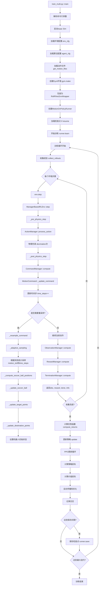

# HumanoidSoccer 代码仓库详细指南

## 📋 目录
- [项目概述](#项目概述)
- [仓库结构](#仓库结构)
- [核心组件](#核心组件)
- [训练流程](#训练流程)
- [测试流程](#测试流程)
- [完整函数调用流程](#完整函数调用流程)

---

## 项目概述

**HumanoidSoccer** 是一个基于强化学习的人形机器人足球技能训练框架，实现了论文 *"Learning Soccer Skills for Humanoid Robots: A Progressive Perception-Action Framework"* 中提出的 **PAiD (Perception-Action integrated Decision-making)** 方法。

### 核心特性
- 基于 **Isaac Lab v2.1.1** 物理仿真引擎
- 使用 **RSL-RL** 强化学习库（PPO算法）
- 支持 **Unitree G1** 人形机器人
- 渐进式训练框架：动作技能获取 → 感知-动作集成 → 真实部署
- 支持多动作序列训练和自适应采样

### 技术栈
- **仿真引擎**: Isaac Sim + Isaac Lab v2.1.1
- **强化学习**: RSL-RL (PPO)
- **深度学习**: PyTorch
- **机器人**: Unitree G1
- **编程语言**: Python 3.x

---

## 仓库结构

```
HumanoidSoccer/
├── source/whole_body_tracking/soccer/    # 核心代码包
│   ├── assets/                           # 机器人模型和资源
│   │   ├── unitree_description/          # Unitree G1 URDF/MJCF
│   │   └── soccer/                       # 足球资源
│   ├── robots/                           # 机器人配置
│   │   ├── g1.py                         # G1机器人定义
│   │   ├── actuator.py                   # 执行器模型
│   │   └── smpl.py                       # SMPL人体模型
│   ├── tasks/                            # 任务定义
│   │   └── tracking/                     # 动作跟踪任务
│   │       ├── tracking_env_cfg.py       # 环境基础配置
│   │       ├── config/g1/                # G1特定配置
│   │       │   ├── __init__.py           # 注册Gym环境
│   │       │   ├── flat_env_cfg.py       # 平地环境配置
│   │       │   ├── soccer_flat_env_cfg.py # 足球环境配置
│   │       │   └── agents/               # RL算法配置
│   │       │       └── rsl_rl_ppo_cfg.py # PPO超参数
│   │       └── mdp/                      # MDP组件
│   │           ├── commands_multi_motion_soccer.py  # 多动作命令
│   │           ├── observations.py       # 观测函数
│   │           ├── rewards.py            # 奖励函数
│   │           ├── terminations.py       # 终止条件
│   │           ├── events.py             # 事件处理
│   │           └── kick_detection.py     # 踢球检测
│   └── utils/                            # 工具函数
│       ├── my_on_policy_runner.py        # 自定义训练器
│       └── exporter.py                   # 模型导出
├── scripts/rsl_rl/                       # 训练和测试脚本
│   ├── train_multi.py                    # 多动作训练脚本
│   ├── play_multi.py                     # 多动作测试脚本
│   ├── train.py                          # 单动作训练脚本
│   ├── play.py                           # 单动作测试脚本
│   ├── train_student.py                  # 学生网络训练
│   └── cli_args.py                       # 命令行参数
├── motions/                              # 动作数据集
│   ├── soccer-standard/                  # 标准足球动作
│   │   ├── soccer-standard-001_right.npz
│   │   ├── soccer-standard-002_left.npz
│   │   └── ...
│   └── soccer-stylized/                  # 风格化足球动作
└── logs/                                 # 训练日志和模型检查点
    └── rsl_rl/
```

---

## 核心组件

### 1. 环境配置 (Environment Configuration)

#### TrackingEnvCfg (`tracking_env_cfg.py`)
基础环境配置类，定义了：
- **场景配置** (`MySceneCfg`): 地形、机器人、光照、接触传感器
- **观测配置** (`ObservationsCfg`): 策略观测和特权观测
- **动作配置** (`ActionsCfg`): 关节位置控制
- **命令配置** (`CommandsCfg`): 动作命令生成
- **奖励配置** (`RewardsCfg`): 奖励函数权重
- **终止配置** (`TerminationsCfg`): episode终止条件
- **事件配置** (`EventCfg`): 域随机化事件

#### 关键参数
```python
decimation = 4              # 控制频率降采样 (50Hz → 12.5Hz)
episode_length_s = 10.0     # episode时长
sim.dt = 0.005              # 仿真时间步长 (200Hz)
num_envs = 4096             # 并行环境数量
```

### 2. 动作命令系统 (Motion Command System)

#### MultiMotionLoader (`commands_multi_motion_soccer.py`)
负责加载和管理多个动作序列：
- 从 `.npz` 文件加载动作数据
- 支持多个动作文件的批量加载
- 数据包含：关节位置/速度、身体位置/姿态、线速度/角速度
- 自动填充到最大帧数以支持批处理

#### MotionCommand
核心命令生成器，实现：
- **自适应采样**: 根据失败统计动态调整采样分布
- **足球位置生成**: 基于动作轨迹计算球的位置
- **目标点跟踪**: 实时更新目标点位置
- **盲区逻辑**: 模拟视觉感知的距离限制
- **踢球检测**: 通过接触传感器检测踢球事件

### 3. MDP组件

#### 观测 (Observations)
**策略观测** (154维):
- 命令信息
- 投影重力向量
- 参考角速度
- 基座角速度
- 关节位置/速度（相对）
- 上一步动作

**特权观测** (Critic):
- 完整的动作锚点位置/姿态
- 身体位置/姿态
- 基座线速度/角速度
- 关节状态

#### 奖励 (Rewards)
主要奖励项：
- `motion_global_anchor_pos`: 全局锚点位置误差 (权重: 1.0)
- `motion_global_anchor_ori`: 全局锚点姿态误差 (权重: 1.0)
- `motion_body_pos`: 相对身体位置误差 (权重: 1.0)
- `motion_body_ori`: 相对身体姿态误差 (权重: 1.0)
- `motion_body_lin_vel`: 身体线速度误差 (权重: 1.0)
- `motion_body_ang_vel`: 身体角速度误差 (权重: 1.0)
- `action_rate_l2`: 动作变化率惩罚 (权重: -0.1)
- `joint_limit`: 关节限位惩罚 (权重: -10.0)
- `undesired_contacts`: 不期望接触惩罚 (权重: -0.1)

#### 终止条件 (Terminations)
- `time_out`: 超时终止
- `anchor_pos_z`: 锚点Z轴位置偏差过大
- `anchor_ori`: 锚点姿态偏差过大
- `ee_body_pos`: 末端执行器位置偏差过大

### 4. 训练器 (Runner)

#### MotionOnPolicyRunner (`my_on_policy_runner.py`)
继承自 RSL-RL 的 `OnPolicyRunner`，扩展功能：
- 自动保存 ONNX 模型
- 集成 WandB 日志记录
- 支持模型导出和元数据附加

---

## 训练流程

### 阶段1: 动作技能获取 (Motion Skill Acquisition)

训练机器人跟踪人类动作捕捉数据。

#### 命令
```bash
python scripts/rsl_rl/train_multi.py \
    --task Tracking-Terrain-G1-RNN-v0 \
    --motion_path motions/soccer-standard \
    --run_name stage1_motion_tracking \
    --num_envs 4096 \
    --headless
```

#### 参数说明
- `--task`: 任务名称（注册在 `__init__.py` 中）
- `--motion_path`: 动作文件目录
- `--run_name`: 实验名称
- `--num_envs`: 并行环境数量
- `--headless`: 无头模式（不显示GUI）

#### 环境特点
- 使用地形随机化
- 纯动作跟踪，无足球交互
- 训练RNN策略以处理部分观测

### 阶段2: 感知-动作集成 (Perception-Action Integration)

在阶段1的基础上，加入足球感知和目标导向。

#### 命令
```bash
# 从阶段1恢复训练
python scripts/rsl_rl/train_multi.py \
    --task Tracking-Flat-G1-SoccerDestination-RNN-v0 \
    --motion_path motions/soccer-standard \
    --load_run stage1_motion_tracking \
    --run_name stage2_soccer_perception \
    --num_envs 4096 \
    --resume True \
    --headless
```

#### 参数说明
- `--load_run`: 加载的检查点运行名称
- `--resume`: 恢复训练标志

#### 环境特点
- 平地环境
- 添加足球对象和目标点
- 观测包含目标点位置和目标方向
- 奖励函数考虑踢球精度

### 单次训练（不使用渐进式）

```bash
python scripts/rsl_rl/train_multi.py \
    --task Tracking-Flat-G1-SoccerDestination-RNN-v0 \
    --motion_path motions/soccer-standard \
    --num_envs 4096 \
    --headless
```

### 训练参数配置

在 `agents/rsl_rl_ppo_cfg.py` 中定义：
```python
max_iterations = 30000          # 最大训练迭代次数
save_interval = 500             # 保存间隔
num_steps_per_env = 24          # 每个环境的步数
num_learning_epochs = 5         # 每次更新的学习轮数
num_mini_batches = 4            # mini-batch数量
learning_rate = 1e-3            # 学习率
gamma = 0.99                    # 折扣因子
lam = 0.95                      # GAE lambda
```

---

## 测试流程

### 基本测试

```bash
python scripts/rsl_rl/play_multi.py \
    --task Tracking-Flat-G1-SoccerDestination-RNN-v0 \
    --motion_path motions/soccer-standard \
    --num_envs 1
```

### 录制视频

```bash
python scripts/rsl_rl/play_multi.py \
    --task Tracking-Flat-G1-SoccerDestination-RNN-v0 \
    --motion_path motions/soccer-standard \
    --num_envs 1 \
    --video \
    --video_length 200
```

### 导出ONNX模型

```bash
python scripts/rsl_rl/play_multi.py \
    --task Tracking-Flat-G1-SoccerDestination-RNN-v0 \
    --motion_path motions/soccer-standard \
    --num_envs 1 \
    --export_motion_name all
```

### 测试特定动作

```bash
python scripts/rsl_rl/play_multi.py \
    --task Tracking-Flat-G1-SoccerDestination-RNN-v0 \
    --motion_file motions/soccer-standard/soccer-standard-001_right.npz \
    --num_envs 1 \
    --export_motion_name soccer-standard-001_right
```

---

## 完整函数调用流程

### 训练时的函数调用流程图



### 详细函数调用栈

#### 1. 初始化阶段

```
train_multi.py::main()
├── argparse.ArgumentParser() - 解析命令行参数
├── AppLauncher(args_cli) - 启动Isaac Sim应用
├── get_motion_files(motion_path) - 获取动作文件列表
├── gym.make(task, cfg=env_cfg) - 创建环境
│   ├── ManagerBasedRLEnv.__init__()
│   │   ├── Scene.setup() - 设置场景
│   │   ├── ActionManager.setup() - 设置动作管理器
│   │   ├── ObservationManager.setup() - 设置观测管理器
│   │   ├── RewardManager.setup() - 设置奖励管理器
│   │   ├── TerminationManager.setup() - 设置终止管理器
│   │   ├── CommandManager.setup() - 设置命令管理器
│   │   │   └── MotionCommand.__init__()
│   │   │       ├── MultiMotionLoader() - 加载所有动作文件
│   │   │       ├── 初始化自适应采样参数
│   │   │       ├── 初始化足球和目标点
│   │   │       └── _sample_soccer_offset()
│   │   └── EventManager.setup() - 设置事件管理器
├── RslRlVecEnvWrapper(env) - 包装环境
└── MotionOnPolicyRunner(env, agent_cfg) - 创建训练器
    ├── PPO.__init__() - 初始化PPO算法
    ├── ActorCritic() - 创建策略网络
    └── RolloutStorage() - 创建经验缓冲区
```

#### 2. 训练循环阶段

```
runner.learn(num_learning_iterations)
└── for it in range(num_iterations):
    ├── collect_rollouts() - 收集经验
    │   └── for step in range(num_steps_per_env):
    │       ├── policy(obs) - 策略网络推理
    │       ├── env.step(actions) - 环境步进
    │       │   ├── _pre_physics_step(actions)
    │       │   │   └── ActionManager.process_action()
    │       │   │       └── JointPositionAction.apply_action()
    │       │   ├── for _ in range(decimation):
    │       │   │   └── sim.step() - 物理仿真
    │       │   └── _post_physics_step()
    │       │       ├── CommandManager.compute()
    │       │       │   └── MotionCommand._update_command()
    │       │       │       ├── time_steps += 1
    │       │       │       ├── if time_steps >= motion_length:
    │       │       │       │   └── _resample_command(env_ids)
    │       │       │       │       ├── _adaptive_sampling()
    │       │       │       │       │   ├── 计算失败统计
    │       │       │       │       │   ├── 卷积平滑概率分布
    │       │       │       │       │   └── torch.multinomial() 采样
    │       │       │       │       ├── _compute_soccer_ball_positions()
    │       │       │       │       ├── _update_soccer_ball()
    │       │       │       │       ├── _update_target_points()
    │       │       │       │       ├── _update_destination_points()
    │       │       │       │       └── robot.write_root_state_to_sim()
    │       │       │       ├── _update_target_points_from_sim()
    │       │       │       └── 更新body_pos_relative_w和body_quat_relative_w
    │       │       ├── ObservationManager.compute()
    │       │       │   ├── generated_commands() - 获取命令
    │       │       │   ├── projected_gravity() - 投影重力
    │       │       │   ├── motion_anchor_ang_vel() - 参考角速度
    │       │       │   ├── base_ang_vel() - 基座角速度
    │       │       │   ├── joint_pos_rel() - 关节位置
    │       │       │   ├── joint_vel_rel() - 关节速度
    │       │       │   └── last_action() - 上一步动作
    │       │       ├── RewardManager.compute()
    │       │       │   ├── motion_global_anchor_position_error_exp()
    │       │       │   ├── motion_global_anchor_orientation_error_exp()
    │       │       │   ├── motion_relative_body_position_error_exp()
    │       │       │   ├── motion_relative_body_orientation_error_exp()
    │       │       │   ├── motion_global_body_linear_velocity_error_exp()
    │       │       │   ├── motion_global_body_angular_velocity_error_exp()
    │       │       │   ├── action_rate_l2_clip()
    │       │       │   ├── joint_pos_limits()
    │       │       │   └── undesired_contacts()
    │       │       └── TerminationManager.compute()
    │       │           ├── time_out()
    │       │           ├── bad_anchor_pos_z_only()
    │       │           ├── bad_anchor_ori()
    │       │           └── bad_motion_body_pos_z_only()
    │       └── storage.add_transitions() - 存储经验
    ├── compute_returns() - 计算GAE优势函数
    ├── update() - PPO更新
    │   └── for epoch in range(num_learning_epochs):
    │       └── for mini_batch in mini_batches:
    │           ├── actor_critic(obs) - 前向传播
    │           ├── compute_policy_loss() - 策略损失
    │           ├── compute_value_loss() - 价值损失
    │           ├── loss.backward() - 反向传播
    │           └── optimizer.step() - 参数更新
    ├── log() - 记录日志到WandB/TensorBoard
    └── if it % save_interval == 0:
        └── save(checkpoint_path) - 保存检查点
            ├── torch.save(model) - 保存PyTorch模型
            └── export_motion_policy_as_onnx() - 导出ONNX
```

#### 3. 关键数据流

**观测数据流**:
```
MotionCommand (命令生成)
    ↓ joint_pos, joint_vel (目标关节状态)
ObservationManager
    ↓ 收集各种观测项
    ↓ generated_commands() → 从MotionCommand获取
    ↓ projected_gravity() → 从robot.data获取
    ↓ joint_pos_rel() → robot.data.joint_pos - command.joint_pos
    ↓ ...
Policy Network
    ↓ 154维观测向量
    ↓ RNN处理 (如果使用RNN)
Actions (关节位置增量)
```

**奖励计算流**:
```
MotionCommand
    ↓ anchor_pos_w, anchor_quat_w (参考姿态)
    ↓ body_pos_w, body_quat_w (参考身体状态)
Robot.data
    ↓ robot_anchor_pos_w, robot_anchor_quat_w (实际姿态)
    ↓ robot_body_pos_w, robot_body_quat_w (实际身体状态)
RewardManager
    ↓ 计算各项误差
    ↓ motion_global_anchor_position_error_exp()
    ↓ motion_global_anchor_orientation_error_exp()
    ↓ ...
Total Reward (加权求和)
```

**自适应采样流**:
```
Episode结束
    ↓ terminated flag
MotionCommand._adaptive_sampling()
    ↓ 记录失败的(motion_idx, time_step)
    ↓ 更新bin_failed_count (EMA)
    ↓ 计算采样概率分布
    ↓ probs = bin_failed_count + uniform_prior
    ↓ probs = conv1d(probs, kernel) (平滑)
    ↓ sampled_flat = multinomial(probs)
    ↓ motion_idx = sampled_flat // bin_count
    ↓ time_steps = (sampled_flat % bin_count) * motion_length / bin_count
新Episode开始
```

---

## 注册的Gym环境

在 `config/g1/__init__.py` 中注册了以下环境：

### 基础动作跟踪
- `Tracking-Flat-G1-v0`: 平地动作跟踪（MLP策略）
- `Tracking-Flat-G1-RNN-v0`: 平地动作跟踪（RNN策略）

### 足球任务 - 阶段1
- `Tracking-Terrain-G1-v0`: 地形动作跟踪（MLP）
- `Tracking-Terrain-G1-RNN-v0`: 地形动作跟踪（RNN）
- `Tracking-Flat-G1-Motion-RNN-v0`: 平地动作跟踪（RNN）

### 足球任务 - 阶段2
- `Tracking-Flat-G1-SoccerDestination-v0`: 目标导向踢球（MLP）
- `Tracking-Flat-G1-SoccerDestination-RNN-v0`: 目标导向踢球（RNN）
- `Tracking-Flat-G1-SoccerMoving-RNN-v0`: 移动球踢球（RNN）

### 高级足球任务
- `Tracking-Flat-G1-SoccerBlind-v0`: 盲区踢球（MLP）
- `Tracking-Flat-G1-SoccerBlind-RNN-v0`: 盲区踢球（RNN）
- `Tracking-Flat-G1-SuperSoccer-v0`: 超级足球（MLP）
- `Tracking-Flat-G1-Soccer-Distillation-v0`: 知识蒸馏

---

## 动作数据格式

`.npz` 文件包含以下字段：
- `fps`: 帧率
- `joint_pos`: 关节位置 [T, num_joints]
- `joint_vel`: 关节速度 [T, num_joints]
- `body_pos_w`: 身体位置（世界坐标） [T, num_bodies, 3]
- `body_quat_w`: 身体姿态（四元数） [T, num_bodies, 4]
- `body_lin_vel_w`: 身体线速度 [T, num_bodies, 3]
- `body_ang_vel_w`: 身体角速度 [T, num_bodies, 3]
- `kick_leg`: 踢球腿标签 ("left" 或 "right")

---

## 常见问题

### 1. 如何调整训练速度？
- 增加 `num_envs` (需要更多GPU内存)
- 减少 `decimation` (更高控制频率，但更慢)
- 调整 `num_steps_per_env` 和 `num_mini_batches`

### 2. 如何添加新的动作？
1. 准备符合格式的 `.npz` 文件
2. 放入 `motions/` 目录
3. 使用 `--motion_path` 指向该目录

### 3. 如何修改奖励函数？
编辑 `tracking_env_cfg.py` 中的 `RewardsCfg` 类，调整权重或添加新的奖励项。

### 4. 如何可视化训练过程？
- 去掉 `--headless` 参数
- 使用 WandB 查看训练曲线
- 使用 `--video` 参数录制视频

---

## 参考资料

- [Isaac Lab 文档](https://isaac-sim.github.io/IsaacLab/)
- [RSL-RL 库](https://github.com/leggedrobotics/rsl_rl)
- [论文链接](https://arxiv.org/abs/2602.05310)
- [项目主页](https://soccer-humanoid.github.io/)

---

**最后更新**: 2026-03-15
